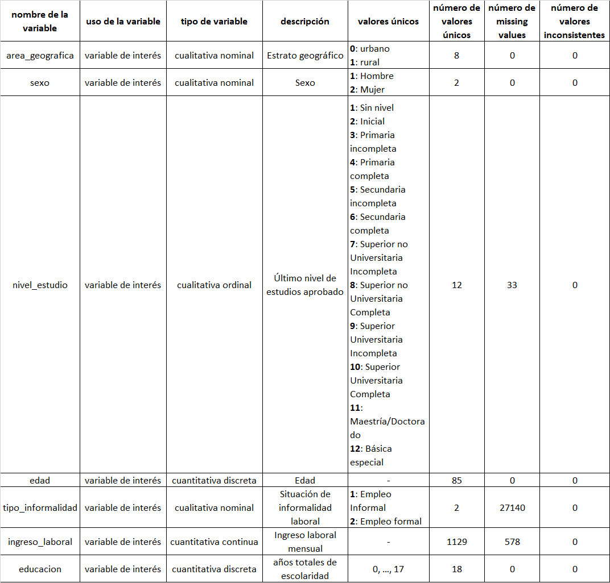

# Visualización - GGPLOT2

Primero elijamos el conjunto de datos (dataset) a emplear.

## Importación del conjunto de datos

Los datos a utilizar en estas notas son los recolectados por el Instituto Nacional de Estadística e Informática (INEI) en la Encuesta Nacional de Hogares (ENAHO) del año 2019. Se descargaron dos conjuntos de datos de una base de datos de MICRODATOS[^intro-1] de INEI que contienen las variables de interés y se procedió a realizar diversas acciones a fin de obtener el dataset que se va a emplear. Específicamente, se escogieron los datos correspondientes a los módulos Educación y Empleo e Ingresos del 2019 de ENAHO.

[^intro-1]: <http://iinei.inei.gob.pe/microdatos/>

El dataset a considerar contiene información sociodemográfica, educativa y salarial de un conjunto de personas de Huancavelica (ver el siguiente cuadro).



1.  **Importar el dataset *dataset_prep_oliveriop***

    ```{r dataset_prep, warning=FALSE}
    # p_install(readxl)
    datosop <- readxl::read_excel(path = "dataset_prep_oliveriop.xlsx",
                                  col_types = "text", 
                                  
                                  na = "NA")
    ```

    -   `readxl`: paquete para importar archivos de Excel a R. Admite archivos `.xls` y `.xlsx`.[^intro-2]

    -   `read_excel`: función de readxl para importar archivos `.xls` y `.xlsx`. Tiene los siguientes argumentos:[^intro-3]

        [{width="187"}](https://cran.r-project.org/web/packages/readxl/readxl.pdf)

        Ahora, toca poner en práctica el inglés[^intro-4].

        | Argumento | Descripción                                                                                                                                                                                                                                                                                                                                                                                                                                                                                                                       |
        |---------------------|---------------------------------------------------|
        | path      | Path to the xls/xlsx file.                                                                                                                                                                                                                                                                                                                                                                                                                                                                                                        |
        | sheet     | Sheet to read. Either a string (the name of a sheet), or an integer (the position of the sheet). Ignored if the sheet is specified via range. If neither argument specifies the sheet, defaults to the first sheet.                                                                                                                                                                                                                                                                                                               |
        | range     | A cell range to read from, as described in cell-specification. Includes typical Excel ranges like "B3:D87", possibly including the sheet name like "Budget! B2:G14", and more. Interpreted strictly, even if the range forces the inclusion of leading or trailing empty rows or columns. Takes precedence over skip, n_max and sheet.                                                                                                                                                                                            |
        | col_names | TRUE to use the first row as column names, FALSE to get default names, or a character vector giving a name for each column. If user provides col_types as a vector, col_names can have one entry per column, i.e. have the same length as col_types, or one entry per unskipped column.                                                                                                                                                                                                                                           |
        | col_types | Either NULL to guess all from the spreadsheet or a character vector containing one entry per column from these options: "skip", "guess", "logical", "numeric", "date", "text" or "list". If exactly one col_type is specified, it will be recycled. The content of a cell in a skipped column is never read and that column will not appear in the data frame output. A list cell loads a column as a list of length 1 vectors, which are typed using the type guessing logic from col_types = NULL, but on a cell-by-cell basis. |
        | na        | Character vector of strings to interpret as missing values. By default, readxl treats blank cells as missing data.                                                                                                                                                                                                                                                                                                                                                                                                                |
        | trim_ws   | Should leading and trailing whitespace be trimmed?                                                                                                                                                                                                                                                                                                                                                                                                                                                                                |
        | skip      | Minimum number of rows to skip before reading anything, be it column names or data. Leading empty rows are automatically skipped, so this is a lower bound. Ignored if range is given.                                                                                                                                                                                                                                                                                                                                            |
        | n_max     | Maximum number of data rows to read. Trailing empty rows are automatically skipped, so this is an upper bound on the number of rows in the returned tibble. Ignored if range is given.                                                                                                                                                                                                                                                                                                                                            |
        | guess_max | Maximum number of data rows to use for guessing column types.                                                                                                                                                                                                                                                                                                                                                                                                                                                                     |

        : Descripción de los argumentos de read_excel. Fuente: <https://cran.r-project.org/web/packages/readxl/readxl.pdf>

2.  **Resumen estadístico de las variables del dataset**

    ```{r resumen}
    #pacman::p_load(skimr)
    datosop |> skimr::skim()
    ```

    -   `skimr`: paquete para generar resúmenes estadísticos de un dataframe o vector.[^intro-5]

    -   `skim`: función de skimr para generar un resumen general de un dataframe.[^intro-6]

        [{width="629"}](https://cran.r-project.org/web/packages/skimr/skimr.pdf)

3.  **Coercionar las variables del dataset**

    ```{r coercion}
    # pacman::p_load(tidyverse)
    dataf <- datosop |> dplyr::mutate(area_geografica = area_geografica |> as.factor(),
                                      sexo = sexo |> as.factor(),
                                      nivel_estudio = nivel_estudio |> as.factor(),
                                      edad = edad |> as.integer(),
                                      tipo_informalidad = tipo_informalidad |> as.factor(),
                                      ingreso_laboral = ingreso_laboral |> as.numeric(),
                                      educacion = educacion |> as.integer())
    ```

    -   `tidyverse`: c

    -   `dplyr`: s

    -   `mutate`: s

    -   `as.factor`: s

    -   `as.integer`: s

    -   `as.numeric`: s

4.  zx

[^intro-2]: <https://cran.r-project.org/web/packages/readxl/index.html>

[^intro-3]: <https://cran.r-project.org/web/packages/readxl/readxl.pdf>

[^intro-4]: Por ahora, no tengo suficiente tiempo para traducir. Recomiendo que comprendan lo leído en inglés directamente, es decir, procuren no realizar procesos de traducción y comprensión en su mente.

[^intro-5]: <https://cran.r-project.org/web/packages/skimr/index.html>

[^intro-6]: <https://cran.r-project.org/web/packages/skimr/skimr.pdf>

### An unnumbered section {.unnumbered}

sd
